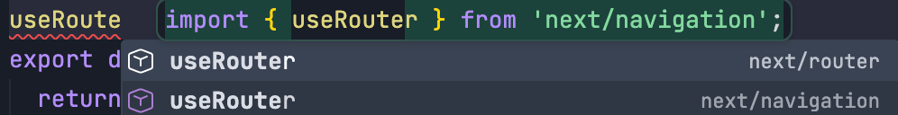

# App Router

## Turbopack

Rust写的，Next.js的默认打包工具，基于Webpack，但更快速、更轻量级。

为什么用Turbopack不用webpack？

### 优势

1. Next需要输出多种环境（客户端、服务端等），多环境用多个编译器处理麻烦且易出错，Turbopack可用统一依赖图处理
2. 惰性打包，只打包开发服务器实际请求内容
3. 增量计算，针对函数缓存，只计算变化的函数，提高打包速度

## react compiler

会自动加react三个性能优化hook：useCallback、useMemo、useRef。

## 路由系统

- page router
- app router(默认)

### 和传统react vue路由配置区别

- 传统路由配置需要手动配置路由表
- app router和page router基于文件系统路由（在对应文件夹下新建文件就会自动配置路由），无需手动配置路由表

### page router和app router的区别

1. 目录结构：

page router：

```
app
└─ pages
    ├── index.tsx -> /
    ├── login.tsx -> /login
    ├── api
    │   └── user.tsx -> /api/user
    ├── posts
    │   └── [id].tsx -> /posts/[id]
    └── blog
        ├── index.tsx -> /blog
        └── setting.tsx -> /blog/setting
```

app router：根据约定定义

```
app
└─ pages
    ├── index.tsx -> /
    ├── login.tsx -> /login
    ├── api
    │   └── user.tsx -> /api/user
    ├── posts
    │   └── [id].tsx -> /posts/[id]
    └── blog
        ├── index.tsx -> /blog
        └── setting.tsx -> /blog/setting
```

2\. 读取数据方式

Pages Router 读取数据需要使用`getServerSideProps / getStaticProps / getStaticPaths`等函数，而App Router则不需要，直接在组件中使用fetch调用即可。

Page router:

```
export async function getServerSideProps() {
  const res = await fetch('xxx');
  const data = await res.json();
  return { props: { data } };
}
export default function Home({ data }) {
  return <div>{data.name}</div>;
}
```

App router:

```
export default async function Home() {
  const res = await fetch('xxx');
  const data = await res.json();
  return <div>{data.name}</div>;
}
```

## layout && template

功能都是**共享UI**，子组件可以共享layout和template中定义的UI。可**嵌套**使用。

如果layout和template都存在，包裹顺序：layout->template->page。

目录结构如下：a/b页面会共用layout和template的UI

```
app
└─ blog
   ├─ layout.tsx
   ├─ template.tsx
   ├─ a
   │  └─ page.tsx
   └─ b
      └─ page.tsx
```

### 区别

1. 持久性，layout使用useState创建的state会持久化，而template中的state不会。
2. 生命周期，layout只初始化一次，template每次切换路由时都会重新初始化（卸载再挂载）。

### loading

loading组件在页面加载时显示，页面加载完成后隐藏。

在目录结构中新建一个loading.tsx会被自动识别到并使用。

### not found（404）

next自带的not-found组件，自定义了就会覆盖next的默认not-found组件。

写在/src/app/目录下全局使用

跳转到空路径时，会自动跳转到not-found404页面。

命名：not-found.tsx

### error

error组件在页面抛出异常时显示。

在目录结构中新建一个error.tsx会被自动识别到并使用。

比较特殊，必须是客户端组件，因此要在首行添加"use client";

# 路由导航

跳转页面方式

## 1. Link组件

增强版a标签

### 属性内容

1. 基本用法

```
<Link href="/home/me" className="text-blue-500">Home Me</Link>
```

2\. 带查询参数

```
<Link href={{pathname: "/home/me", query: { name: "bytedance" }}} className="text-blue-500">Home Me</Link>
```

接收方式：

```
import { useSearchParams } from 'next/navigation';
const searchParams = useSearchParams();
const name = searchParams.get('name');
console.log(name);
```

- get()方法接收参数，返回查询参数的值。
- 如果要接收同命名的查询参数，使用`searchParams.getAll('name')`。
- 如果要确认查询参数是否存在，使用`searchParams.has('name')`。

3\. 预获取prefetch

```
<Link href="/home/me" prefetch="auto">Home Me</Link>
```

- 默认开启，只在生产环境有效
- link组件出现在可视区内，会提交把该页面的资源预获取到本地，避免用户点击后出现加载延迟或页面。

4\. 保持滚动位置scroll

```
<Link href="/home/me" scroll="auto">Home Me</Link>
```

- 默认跳转到页面顶部
- 可以设置为`false`，跳转页面，保持当前滚动位置

5\. 跳转不保留历史记录replace

```
<Link href="/home/me" replace="true">Home Me</Link>
```

- 默认跳转页面，不保留历史记录，即从a跳转到b，b页面返回，跳转不到a页面

## 2. useRouter Hook

useRouter Hook是一个客户端hook，需在顶部写"use client";

引入时会发现有两种

- Pages Router->next/router
- App Router->next/navigation

### 属性内容
1. 基本用法
```
<button onClick={() => router.push('/home/me')}>跳转到Home Me</button>
```

2\. 带查询参数
```
<button onClick={() => router.push('/home/me2?id=123', { scroll: false })}>跳转到Home Me 2</button>
```
- 参数直接拼接在路径后面

3\. prefetch、replace同上

4\. refresh、back、forward
```
<button onClick={() => router.refresh()}>刷新当前页面</button>
<button onClick={() => router.back()}>返回上一页</button>
<button onClick={() => router.forward()}>返回下一页</button>
```
- 刷新当前页面
- 返回上一页
- 返回下一页

## redirect、permanentRedirect函数
重定向到指定路径，一般应用在服务端组件
```
import { redirect } from 'next/navigation';
export default function Home() {
  if (true) {
    return redirect('/home/me'); 
    // return permanentRedirect('/home/me');
  }
}
```
- 两者区别：redirect是临时重定向307，permanentRedirect是永久重定向308
